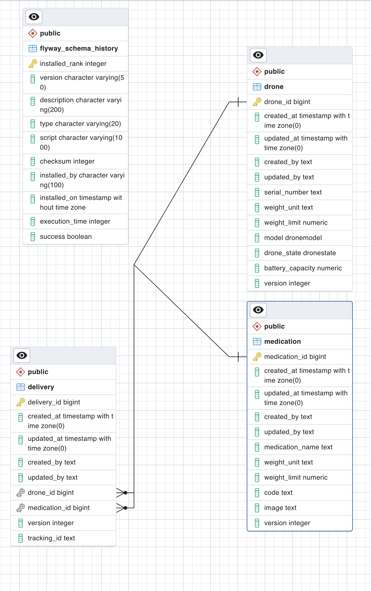

# Drone Delivery API

A Drone Delivery Web API that simulates the day-to-day operations of a delivering medication.

## Authors

- [@olasoj](https://www.github.com/olasoj)

## Features

**The following functionalities are available in this application:**

- Users can read register drones.

- Users can load up drones with medication.

- Users can view load up drones and medications.

- This system was built using the spring-boot framework and Postgres database, following the best principles in software engineering.

## Environment Variables

This project made no use of environmental variables.

## Run Locally

Clone the project

```bash
   git clone -b main https://github.com/olasoj/drone-delivery-app.git
```

Go to the project directory

```bash
  cd drone-delivery-app
```

Start the drone-delivery-app

```bash
   docker-compose up -d --build
```

## Documentation

[Documentation](https://documenter.getpostman.com/view/7357801/2s9YXfc3ok)

## Tech Stack

**Client:** Postman

**Server:** Java, Spring boot

**Database:** Postgres
